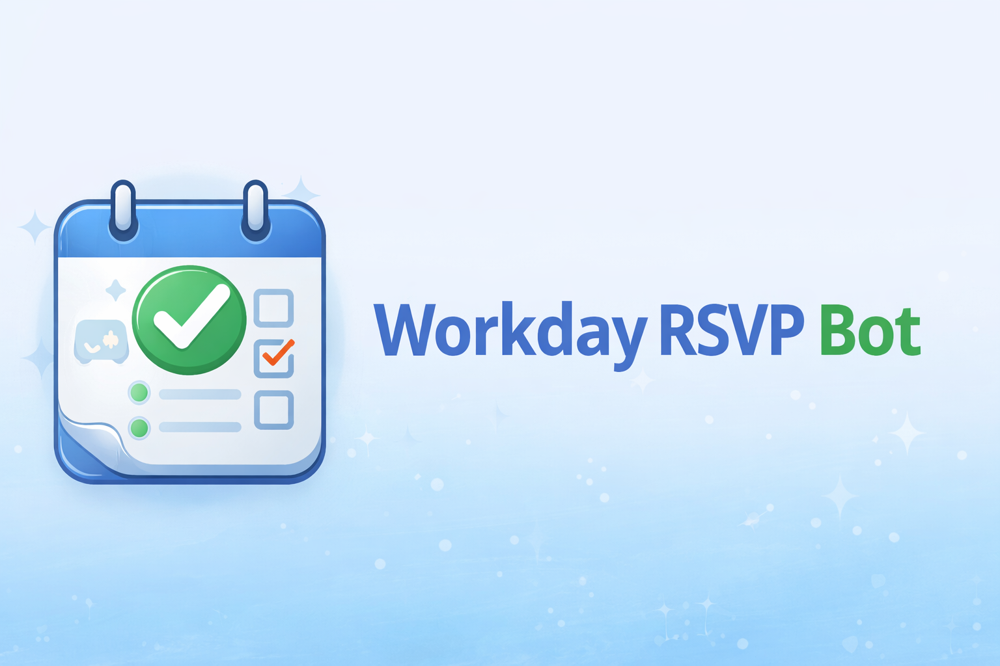

Workday RSVP Bot
================

Overview
--------

The Workday RSVP Bot is a Discord application designed to coordinate recurring
workdays through a persistent RSVP panel and an automated weekly lifecycle.

It provides:

- Structured RSVP collection
- Partner planning workflows
- Automated reminders
- Self-maintaining weekly rollovers

Once configured, the bot operates largely autonomously while remaining fully
configurable by administrators.

---

Getting Started
---------------

New to the project? Start here:

.. toctree::
   :maxdepth: 1

   getting-started/quickstart
   getting-started/installation

---

User Guide
----------

Learn how to use the bot in real deployments:

.. toctree::
   :maxdepth: 1

   user-guide/commands
   user-guide/dev-vs-prod

---

Concepts
--------

Understand the design principles and runtime model:

.. toctree::
   :maxdepth: 1

   concepts/architecture
   concepts/scheduling
   concepts/directory-system
   concepts/panels

---

API Reference
-------------

Developer-facing documentation generated from the source code.

.. toctree::
   :maxdepth: 2

   api/index
